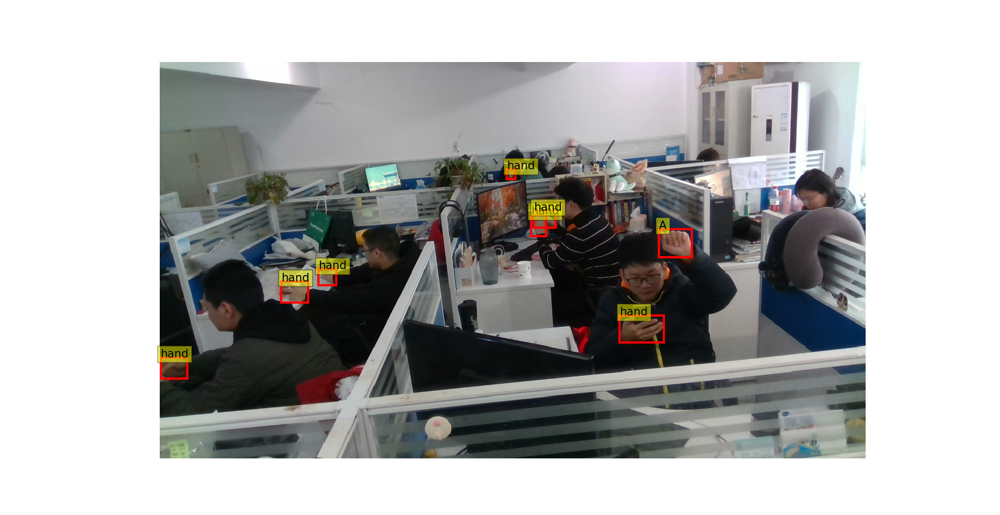

## Semi-supervised Joint Learning for Hand Gesture Recognition from a Single Color Image 


## CUG Hand dataset

​	The dataset contains 1757 color images, in which 1273 images are used for training, and 484 images are used for testing. The resolution of the image is 1280 × 720. The images are collected from 27 distinct subjects. The number of subjects on a single image varies from 1 to 7, which results in up to 8 hands per image. The dataset contains static ASL hand gestures, and the number of classes is 24 (the dynamic ASL gestures j and z are not included). In each image, there exist many background hands and a foreground hand performing an ASL hand gesture. In the training images, there are 5024 background hand instances and 1273 foreground hand instances. And in the testing images, there are 1485 background hand instances and 484 foreground hand instances. The area of the hand bounding boxes varies from 238 to 73,062 pixel^2 . The CUG-Hand dataset provides the bounding boxes of all hand instances, and the gesture category of the foreground hands. The dataset does not have hand pose annotation.

<hr>

The dataset can be downloaded [CUG_Hand_Dataset](https://drive.google.com/file/d/1MFRkc1Y3UID8kN-MccPqQMJtUmiLvhQZ/view?usp=sharing)

```
${ROOT}
|-- CUG_Hand
|   |-- 1
|   |-- 2
|   |-- ...
|   |-- 34
|   |-- testing_dataset.npy
|   |-- training_dataset.npy
|-- ASLDataset.py
```

#### Label

In CUG_Hand Dataset, we package GT into  `.npy ` file, and the labels corresponding to each image are as follows:

```
target = 
{'depth_dir': '/28/1291_depth.png', 
 'rgb_dir': '28/1291_color.png',
 'label': tensor([15,  1,  1,  1,  1,  1], dtype=torch.int32),
 'boxes': tensor([[ 784,  343,  838,  440],
        		  [1084,  412, 1176,  523],
                  [ 616,  374,  703,  466],
                  [ 683,  539,  763,  604],
                  [ 352,  441,  463,  547],
                  [ 237,  621,  391,  720]], dtype=torch.int32),
 'depth_val': tensor([1361, 1133, 1451, 1281,  904,  779], dtype=torch.int32)}
```

in where, `label` represents the category of each hand in the image, and `boxes` is the corresponding  box, and `depth_val` is the depth of the hand relative to the camera.


#### 	View 

You can run `ASLDataset.py` to see the picture. 



## Reference  

```  
@article{xu2021semi,
  title={Semi-Supervised Joint Learning for Hand Gesture Recognition from a Single Color Image},
  author={Xu, Chi and Jiang, Yunkai and Zhou, Jun and Liu, Yi},
  journal={Sensors},
  volume={21},
  number={3},
  pages={1007},
  year={2021},
  publisher={Multidisciplinary Digital Publishing Institute}
}

```
